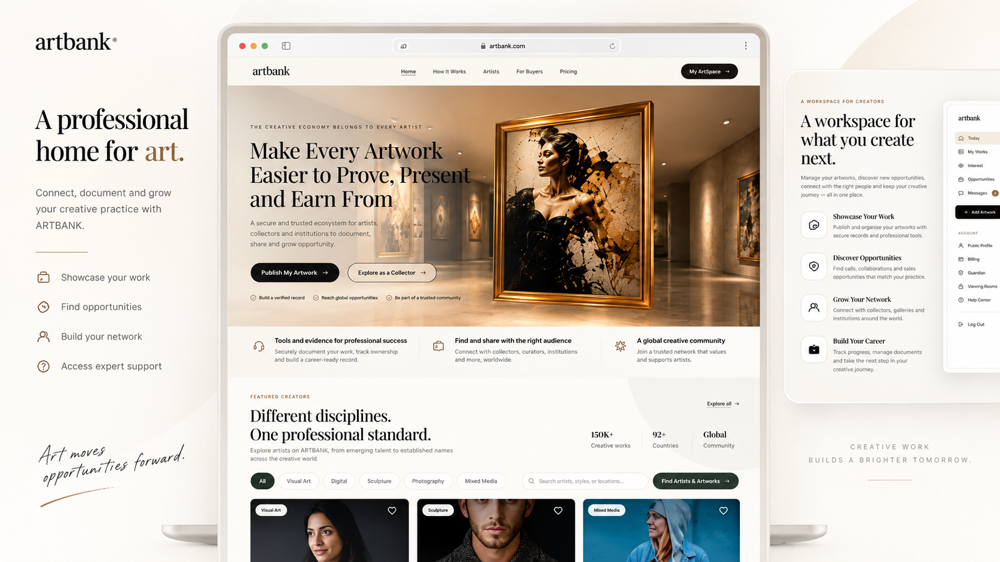
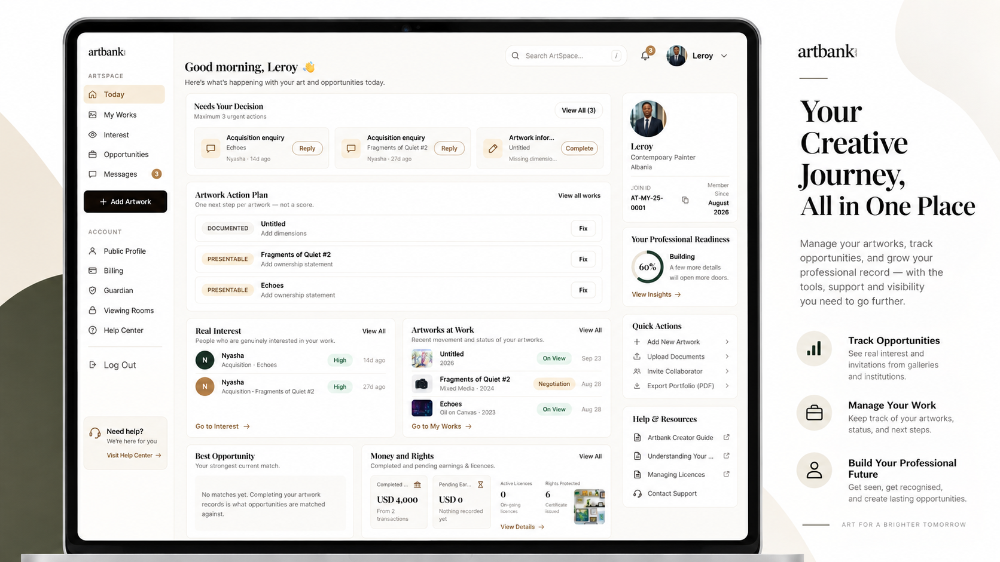
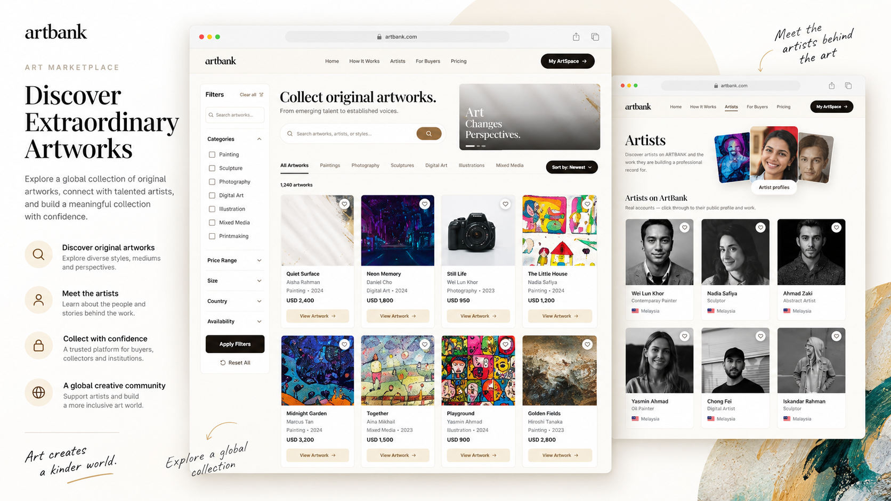
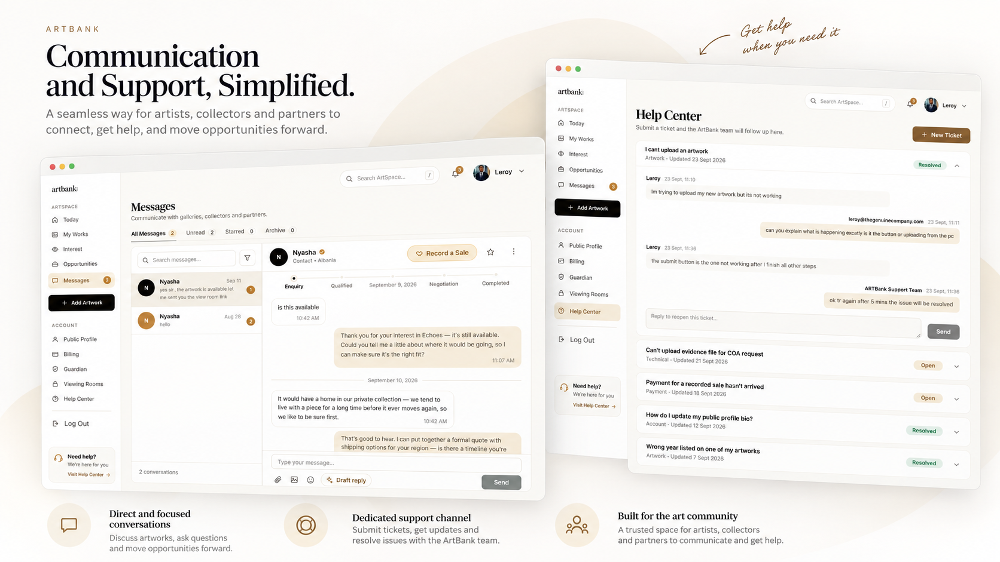

# ARTBANK — Case Study

**A full-stack digital art ecosystem built from the ground up during my software development internship.**

[Live Product](https://artbank.world/) · [LinkedIn](https://www.linkedin.com/in/leroy-nyasha-mangwarara-86185a302/) · [GitHub Profile](https://github.com/Leroy-laboe)

> **Source code is private.** This public repository is a technical case study and product showcase. It documents the product, architecture, workflows, and engineering decisions without exposing the implementation source.

---



## What is ARTBANK?

ARTBANK is a digital ecosystem designed around the full lifecycle of an artwork — from documentation and publishing to discovery, enquiries, conversations, viewing rooms, deal tracking, and post-sale records.

I built the system from the ground up during my software development internship, working across product design, frontend engineering, database modelling, authentication, multi-role workflows, security, and deployment.

The product supports four major user groups:

| Role | Experience |
| --- | --- |
| **Artist** | Create a profile, document artworks, publish work, manage enquiries, conversations, viewing rooms, deals, and records |
| **Buyer** | Discover artworks, save work, send identified enquiries, communicate with artists, and track purchases |
| **Guardian** | Oversee protected workflows involving minor artists |
| **Administrator** | Manage users, support workflows, review records, and perform administrative actions |

---

## Product Scope

ARTBANK grew beyond a simple gallery or listing platform.

The system includes:

- artist onboarding and public profiles;
- structured artwork records;
- multi-step artwork uploads;
- private document storage;
- artwork visibility and lifecycle states;
- buyer discovery and saved works;
- identified enquiries;
- artist–buyer messaging;
- viewing rooms;
- deal and purchase tracking;
- guardian workflows for minors;
- administrator tools;
- support ticket workflows;
- database-level authorization;
- security-hardening migrations.

---

## Product Walkthrough

### 1. Artist Workspace

Artists can manage their profile, document artwork, control what is public, respond to enquiries, manage conversations, create viewing experiences, and track sales activity.



---

### 2. Buyer Experience

Buyers can discover artwork, save pieces, view public artist profiles, send structured enquiries, communicate with artists, and track purchase activity.



---

### 3. Communication & Support

ARTBANK keeps artist–buyer communication inside the platform and includes a dedicated support-ticket flow for reporting issues and receiving follow-up from the ARTBANK team.



---

## Architecture

```text
                         ┌───────────────────────────┐
                         │     React + TypeScript    │
                         │     Product Interface     │
                         └─────────────┬─────────────┘
                                       │
                                       ▼
                         ┌───────────────────────────┐
                         │      Supabase Auth        │
                         │       PostgREST API       │
                         └─────────────┬─────────────┘
                                       │
                                       ▼
┌──────────────────┐     ┌───────────────────────────┐     ┌──────────────────┐
│ Supabase Storage │◄────│ PostgreSQL + RLS Policies│────►│ Realtime / Events│
└──────────────────┘     └─────────────┬─────────────┘     └──────────────────┘
                                       │
                                       ▼
                         ┌───────────────────────────┐
                         │ Constraints / Triggers /  │
                         │ Functions / Migrations    │
                         └───────────────────────────┘

Optional authentication integration path:

React → Fastify → OIDC Provider → PostgreSQL-backed Sessions
```

### Why this architecture?

A major architectural decision was to place important authorization and business rules at the database layer rather than trusting only the UI.

This means rules remain enforced even if the application is accessed from another client or future interface.

---

## Engineering Highlights

### Database-enforced authorization

ARTBANK uses PostgreSQL **Row Level Security** to control access to user, artwork, conversation, purchase, guardian, and administration data.

This goes beyond hiding buttons in the frontend. The database itself decides whether an operation is allowed.

---

### Business rules as constraints and triggers

Important product rules are represented directly in the schema.

Examples include:

- identified enquiries must have a valid user attached;
- protected payment states cannot be arbitrarily written by the browser;
- guardian relationships must be valid before protected conversations can be created;
- artwork history is intentionally restricted from normal update/delete operations;
- sensitive user fields are protected from unauthorized modification.

---

### Security hardening

The project includes dedicated security passes covering areas such as:

- role and privilege escalation;
- unauthorized user-data exposure;
- suspended-account behaviour;
- conversation access;
- minor and guardian workflows;
- storage access;
- administrative operations;
- safe redirects and authentication boundaries.

Security work was treated as part of product engineering rather than as a final cosmetic step.

---

### Multi-role product design

The same underlying data must make sense from several perspectives.

For example, a single enquiry can appear as:

- an enquiry sent by a buyer;
- an interest record received by an artist;
- a conversation associated with an artwork;
- a record visible to administration under the correct conditions.

Designing one data model to support those views without duplicating state was one of the most important parts of the build.

---

### Authentication and session engineering

The repository also contains an auxiliary OIDC integration path built around:

- PKCE;
- `state` and `nonce`;
- server-side token handling;
- opaque session cookies;
- refresh-token coordination through PostgreSQL;
- identity matching using stable provider identifiers rather than mutable email addresses.

---

## Tech Stack

| Area | Technologies |
| --- | --- |
| **Frontend** | React 19, TypeScript, Vite |
| **UI** | CSS Modules, Tailwind CSS, Radix UI, Framer Motion |
| **Database** | PostgreSQL |
| **Backend Services** | Supabase, PostgREST |
| **Authentication** | Supabase Auth, OIDC integration |
| **Server Integration** | Fastify, JOSE |
| **Storage** | Supabase Storage |
| **Security** | Row Level Security, constraints, triggers, database functions |
| **Deployment** | Vercel |
| **Tooling** | Git, TypeScript, Oxlint |

---

## Selected Engineering Problems I Solved

### Preventing clients from claiming a payment succeeded

A browser is allowed to start or participate in a payment workflow, but it should not be trusted to declare that money arrived.

I designed the data rules so sensitive payment transitions are restricted according to the payment route and actor involved.

### Protecting minor artists

Guardian protection could not simply be a frontend warning. The underlying relationship between the minor and guardian had to be valid before certain interactions could exist.

This required enforcing the relationship in the data layer.

### Handling concurrent session refresh

Rotating refresh tokens can fail when multiple browser tabs attempt to refresh the same session simultaneously.

The OIDC path uses PostgreSQL as the coordination point rather than relying on an in-memory lock that would fail across multiple server processes.

### Preventing duplicated state

Artist and buyer workspaces often view the same interaction from different directions.

Where possible, I designed those experiences to read from the same underlying records rather than storing duplicate status fields that could drift apart.

---

## Database Evolution

The platform was developed through a long series of PostgreSQL migrations covering:

- core identity and profile data;
- artworks and media;
- enquiries;
- conversations;
- opportunities;
- guardians;
- viewing rooms;
- purchase and payment flows;
- dashboards;
- administration;
- security hardening;
- support workflows.

This migration-driven approach made schema changes explicit and traceable throughout the build.

---

## My Role

**Software Developer — Internship Project**

I built ARTBANK from the ground up during my software development internship.

My work included:

- translating product requirements into working interfaces and workflows;
- designing the React/TypeScript application architecture;
- building the artist, buyer, guardian, administrator, and public experiences;
- designing Supabase/PostgreSQL tables and relationships;
- implementing Row Level Security policies;
- creating and evolving database migrations;
- building authentication and role-aware routing;
- implementing marketplace, messaging, viewing-room, deal, and support workflows;
- debugging complex state and permission issues;
- improving responsive behaviour and accessibility;
- hardening authorization and data access;
- deploying and iterating on the live product.

---

## What I Learned

ARTBANK was one of the projects that changed how I think about software engineering.

It pushed me beyond building interfaces and made me think about:

- authorization as a system rather than a button state;
- database constraints as part of product design;
- how different user roles share the same underlying data;
- partial failures and transaction boundaries;
- authentication and session security;
- how product requirements evolve while a system is already being built;
- maintaining clarity as a codebase grows.

---

## Screenshots

The visuals below are polished presentation mockups based directly on the live ARTBANK screens. They simplify framing and crop for readability, but they do not introduce functionality that is not present in the product.

| Product Area | Preview |
| --- | --- |
| Product Overview |  |
| Artist Workspace |  |
| Marketplace & Discovery |  |
| Communication & Support |  |

---

## Live Product

### [Open ARTBANK →](https://artbank.world/)

---

## Source Availability

The implementation repository is intentionally private.

This case study exists to demonstrate the product and the engineering work without making the complete professional codebase publicly cloneable.

If you are reviewing my work for an employment opportunity, the live product and this case study provide the public overview. I can discuss the architecture, engineering decisions, challenges, and my implementation work in an interview or technical walkthrough.

---

## Contact

**Leroy Nyasha Mangwarara**

Software Engineer · Full-Stack · Applied AI · Data

[LinkedIn](https://www.linkedin.com/in/leroy-nyasha-mangwarara-86185a302/) · [GitHub](https://github.com/Leroy-laboe) · [Email](mailto:mangwararaleroy@gmail.com)
